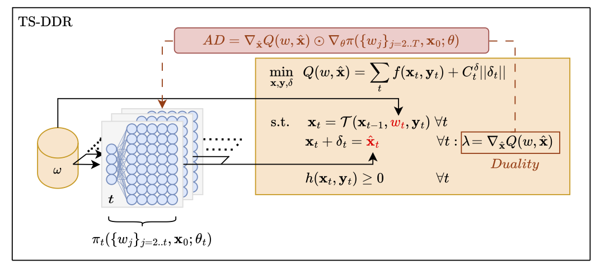

[](https://github.com/LearningToOptimize/DecisionRules.jl/actions/workflows/CI.yml?query=branch%3Amain)

# DecisionRules.jl

DecisionRules.jl is a Julia package for **training parametric decision rules through multi-stage optimization**, following the **Two-Stage General / Deep Decision Rules** (TS-GDR / TS-DDR) framework. The main use-case is multi-stage stochastic control where the feasible (closed-loop) action at each stage is obtained by solving an optimization problem (e.g., OPF, MPC), and we want to train a policy end-to-end that maps observed states and uncertainties to target trajectories.



## Motivation and workflow

In TS-GDR, the policy does not directly output a control action. Instead, it outputs **targets** (typically a target state trajectory) that are enforced inside an optimization model through *target constraints* with slack. For a sampled uncertainty trajectory $($w_{1:T})$, the workflow is:

1. sample $w_{1:T}$
2. predict targets $\hat x_{1:T} = \pi(\cdot;\theta)$
3. solve an optimization problem that projects targets onto the feasible set (dynamics + constraints)
4. differentiate to update $\theta$ using dual information and/or implicit sensitivities (via DiffOpt)

DecisionRules.jl implements this workflow in three flavors:

- **Deterministic equivalent (direct transcription)**: one coupled optimization over the full horizon.
- **Stage-wise decomposition (single shooting)**: one optimization per stage in a sequential rollout.
- **Windowed decomposition (multiple shooting)**: one coupled optimization per window, chained by the realized end-state.

## Installation

```julia
using Pkg
Pkg.add(url="https://github.com/LearningToOptimize/DecisionRules.jl.git")
```

## What you need to provide

DecisionRules.jl is intentionally “model-first”: you describe your problem in JuMP (DiffOpt-enabled for all but the deterministic equivalent approach), then the package handles simulation and training.

For any multi-stage model you will need:

- `subproblems::Vector{JuMP.Model}`: one JuMP model per stage (DiffOpt-enabled).
- `state_params_in[t]`: a vector of **parameter variables** for the incoming state at stage `t`.
- `state_params_out[t]`: a vector of `(target_param, realized_state_var)` tuples at stage `t`.
  The `target_param` is the **parameter variable** that the policy sets; the `realized_state_var` is the JuMP decision variable whose value becomes the realized state.
- an `uncertainty_sampler` that returns per-stage samples in the format used by `DecisionRules.sample(...)`.
- Differentiable policies built with Flux.jl or similar compatible libraries. Input size is the number of uncertainty components per stage plus the size of the initial state; output size is the size of the target state at each stage.

Working patterns are provided in `examples/`.

## Deterministic equivalent (TS-DDR / direct transcription)

This corresponds to solving one coupled optimization over all stages (the deterministic equivalent of a sampled trajectory). You build the deterministic-equivalent JuMP model with `DecisionRules.deterministic_equivalent!` and then train with the deterministic-equivalent overload of `train_multistage`.

```julia
using DecisionRules, JuMP, DiffOpt, Flux
using SCS

# 1) Build per-stage subproblems (DiffOpt-enabled) and collect:
#    subproblems, state_params_in, state_params_out, uncertainty_sampler, uncertainties_structure

# 2) Build the deterministic equivalent over the full horizon
det = DiffOpt.diff_model(() -> DiffOpt.diff_optimizer(SCS.Optimizer))

det, uncertainties_structure_det = DecisionRules.deterministic_equivalent!(
    det,
    subproblems,
    state_params_in,
    state_params_out,
    Float64.(initial_state),
    uncertainties_structure,
)

# 3) Train a TS-DDR policy end-to-end
num_uncertainties = length(uncertainty_sampler()[1])  # number of uncertainty components per stage
policy = Chain(
    Dense(DecisionRules.policy_input_dim(num_uncertainties, length(initial_state)), 64, relu),
    Dense(64, length(initial_state)),
)

DecisionRules.train_multistage(
    policy,
    initial_state,
    det,
    state_in_det,
    state_out_det,
    uncertainty_sampler;
    num_batches=100,
    num_train_per_batch=32,
    optimizer=Flux.Adam(1e-3),
)
```

This mode typically gives the most faithful gradient signal (full coupling across the horizon), but it requires solving the largest inner problem per sample.

## Stage-wise decomposition (single shooting)

Single shooting solves one optimization per stage and rolls forward using the realized state returned by the solver. The policy can be **closed-loop** because it receives the realized state $x_{t-1}$ when predicting the next target $\hat x_t$.

```julia
using DecisionRules, Flux

num_uncertainties = length(uncertainty_sampler()[1])
policy = Chain(
    Dense(DecisionRules.policy_input_dim(num_uncertainties, length(initial_state)), 64, relu),
    Dense(64, length(initial_state)),
)

DecisionRules.train_multistage(
    policy,
    initial_state,
    subproblems,
    state_params_in,
    state_params_out,
    uncertainty_sampler;
    num_batches=100,
    num_train_per_batch=32,
    optimizer=Flux.Adam(1e-3),
)
```

Internally, gradients are obtained by combining (i) dual information for target parameters and (ii) solution sensitivities computed through **DiffOpt** along the rollout.

## Windowed decomposition (multiple shooting)

Multiple shooting partitions the horizon into windows of length `window_size`. Each window solves a deterministic equivalent over its stages, then passes the realized end state to the next window. This can stabilize learning over long horizons compared to pure single shooting, while remaining cheaper than a full-horizon deterministic equivalent.

```julia
using DecisionRules, Flux, DiffOpt
using SCS

num_uncertainties = length(uncertainty_sampler()[1])
policy = Chain(
    Dense(DecisionRules.policy_input_dim(num_uncertainties, length(initial_state)), 64, relu),
    Dense(64, length(initial_state)),
)

DecisionRules.train_multiple_shooting(
    policy,
    initial_state,
    subproblems,
    state_params_in,
    state_params_out,
    uncertainty_sampler;
    window_size=24,  # e.g., 6, 24, ...
    num_batches=100,
    num_train_per_batch=32,
    optimizer=Flux.Adam(1e-3),
    optimizer_factory=() -> DiffOpt.diff_optimizer(SCS.Optimizer),
)
```

If you want lower-level control, you can pre-build the window models once:

```julia
windows = DecisionRules.setup_shooting_windows(
    subproblems,
    state_params_in,
    state_params_out,
    Float64.(initial_state),
    uncertainties_structure;
    window_size=24,
    optimizer_factory=() -> DiffOpt.diff_optimizer(SCS.Optimizer),
)

uncertainty_sample = uncertainty_sampler()
uncertainties_vec = [[Float32(u[2]) for u in stage_u] for stage_u in uncertainty_sample]

obj = DecisionRules.simulate_multiple_shooting(
    windows,
    policy,
    Float32.(initial_state),
    uncertainty_sample,
    uncertainties_vec,
)
```

## Examples and tests

Examples live in `examples/`. Run tests with:

```julia
julia --project -e 'using Pkg; Pkg.test()'
```

## Citation

If you use this package in academic work, please cite:

```bibtex
@article{rosemberg2024efficiently,
  title={Efficiently Training Deep-Learning Parametric Policies using Lagrangian Duality},
  author={Rosemberg, Andrew and Street, Alexandre and Vallad{\~a}o, Davi M and Van Hentenryck, Pascal},
  journal={arXiv preprint arXiv:2405.14973},
  year={2024}
}
```

DiffOpt (for differentiating through optimization): https://github.com/jump-dev/DiffOpt.jl

## License

MIT. See `LICENSE`.
