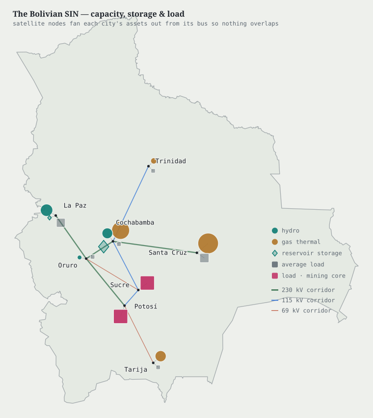
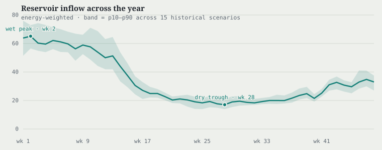
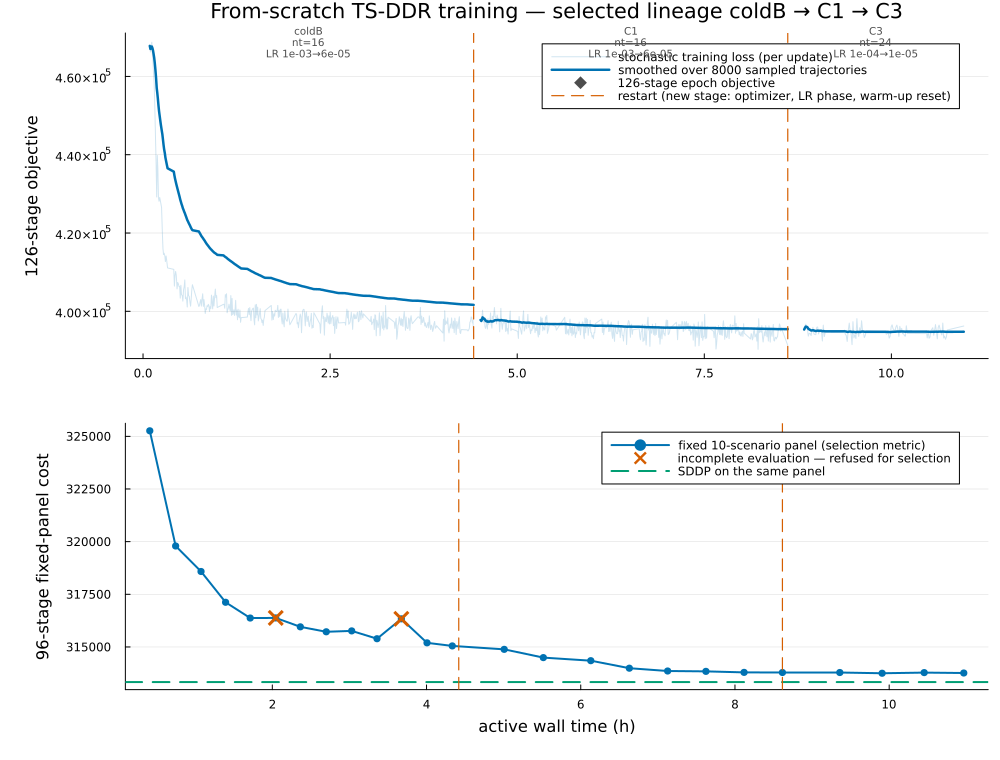
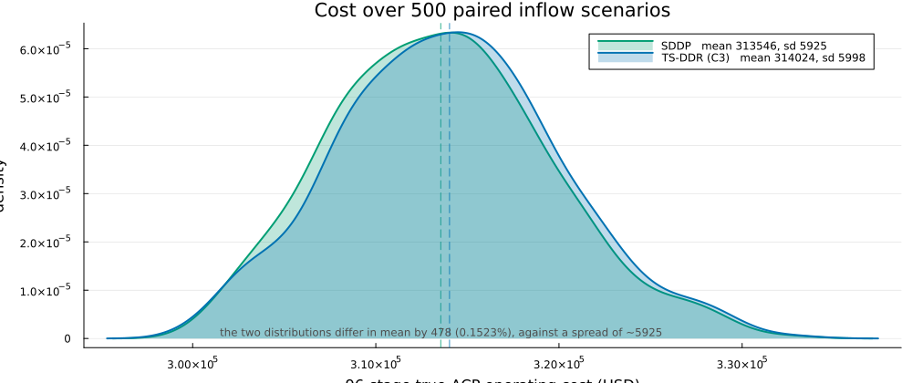
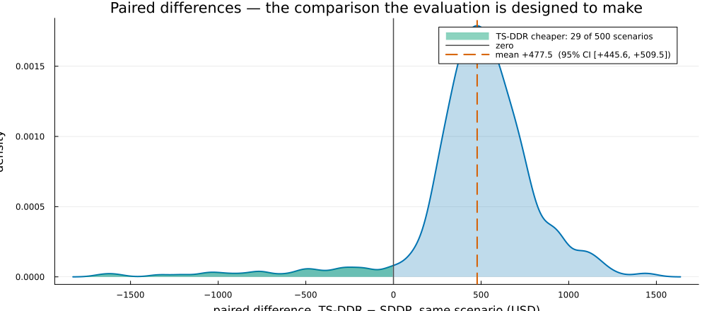
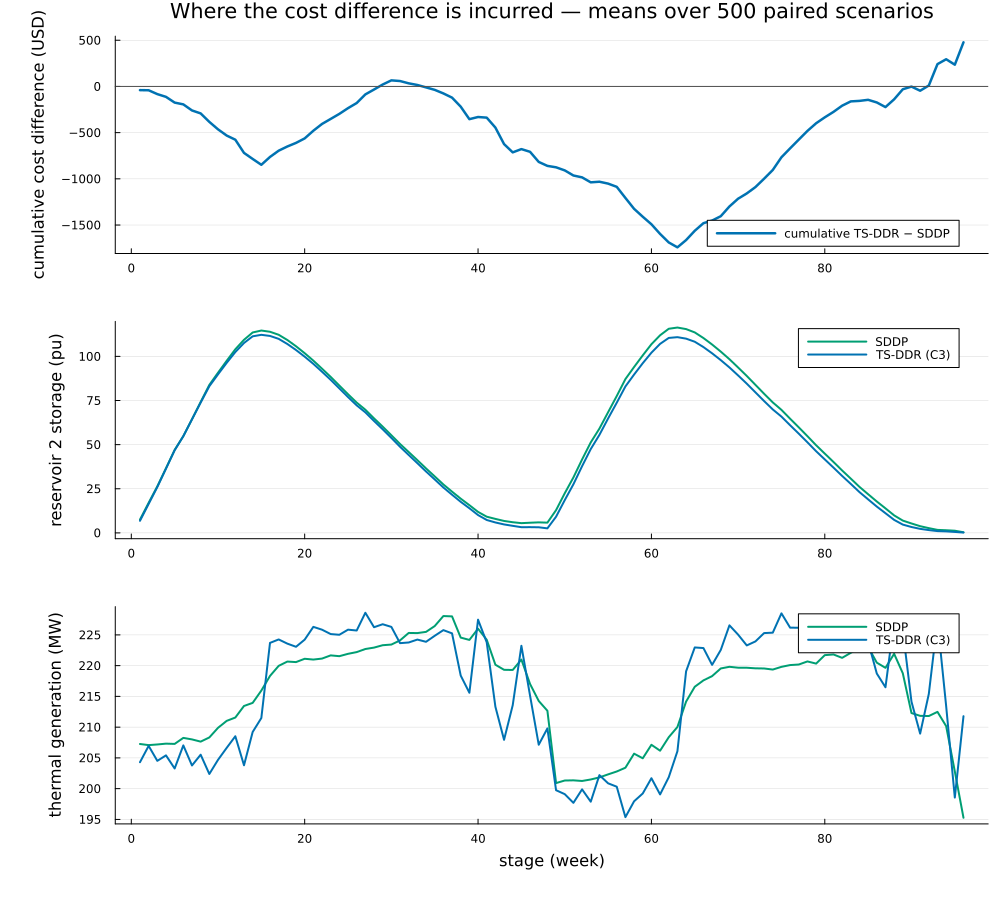
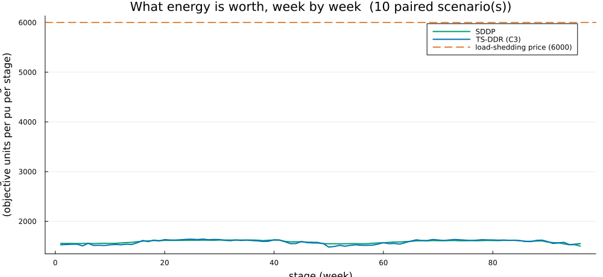

# Results

```@meta
CurrentModule = DecisionRules
```

The system is the Bolivian national grid — 28 buses, 31 branches, 34 generators
and 11 hydro units in three cascades — operated over weekly stages under the full
AC power-flow equations.

```@raw html

```

Two features of the instance make the planning problem bite. The cascades are
leveraged: water released by the large seasonal reservoir at the head of a chain
is worth its own production factor *plus* that of the run-of-river plant
immediately below it, so where water is stored matters as much as how much. And
the demand peak falls in the **dry** season, so the water most tempting to spend
is exactly the water that will be scarcest when it is needed.

```@raw html

```

Both policies were evaluated on the same 500 inflow scenarios, drawn once and
shared by every engine. Pairing is what makes the comparison decidable: the
spread of cost across scenarios is about 6,000, while the quantity being measured
is a mean difference of about 480. Comparing unpaired distributions of that shape
would need orders of magnitude more scenarios.

## The comparison

| policy | mean operating cost | standard deviation |
|---|---|---|
| SDDP | **313,546.09** | 5,925.42 |
| TS-DDR, trained from scratch | **314,023.62** | 5,998.37 |

Paired difference, TS-DDR − SDDP, over 500 scenarios:

| | |
|---|---|
| mean | **+477.53** |
| standard error | 16.25 |
| *t* | 29.38 |
| 95% confidence interval | **[+445.60, +509.46]** |
| relative | **+0.152299%**, CI **[+0.142115%, +0.162483%]** |
| scenarios where TS-DDR is cheaper | **29 of 500** |
| load shed, either policy | none |
| scenarios solved | 500 / 500, both |

Time to policy, from random initialisation on a single GPU: **10.97 hours**
across three phases and 890 gradient updates. A fourth phase was attempted,
produced no selectable policy, and is excluded from the lineage; including its
cost, the whole search took 11.82 hours.

```@raw html

```

The training figure keeps three quantities apart on purpose, because they are
routinely conflated. The **stochastic training loss** is one noisy sample per
update, drawn faintly and smoothed over a fixed number of sampled trajectories —
not a fixed number of updates, since the sample size changes between phases and a
fixed-update window would change the curve's noise for reasons unrelated to
learning. The smoothing resets at each restart. The **fixed-panel evaluation**
that actually selects checkpoints lives on its own axis below, because it differs
in horizon, in sampling and in level; plotting the two together invites reading a
dip in a noisy sample as progress. Evaluations that failed to complete are marked
as refused rather than quietly averaged in.

## What the difference means

**TS-DDR is more expensive than SDDP here, by a small but statistically
unambiguous margin.** The gap is 0.15% of operating cost. Its significance —
*t* = 29.4 — is a property of the paired design and the sample size, not of the
effect's size: the difference is fifteen times smaller than the standard
deviation of either policy's own cost distribution.

Three statements would be wrong, and are not made:

- **not** that the two policies are equal. They are distinguishable, decisively;
- **not** that TS-DDR beat SDDP. It did not, on the mean. It is cheaper on 29
  scenarios and its best case beats SDDP by 1,657, but the confidence interval
  excludes zero by a wide margin;
- **not** that 0.15% is negligible. Whether it matters is an operational question
  about the system being planned, not a statistical one.

What can be said is the honest claim, and it is still an interesting one: **a
policy learned from scratch in eleven GPU-hours, with no value function and no
convex relaxation anywhere in its path, operates this system within 0.15% of a
converged SDDP policy that was given a relaxation to build its cuts with.**

```@raw html


```

The absolute distributions overlap almost completely — which is the point of the
paired design, since the difference between them is far smaller than either one's
spread. The paired differences resolve what the overlay cannot.

## Where the difference comes from

The aggregate hides the mechanism. Cumulatively, TS-DDR runs **cheaper** than
SDDP through most of the horizon — by about 1,700 at its widest — and the entire
final difference is incurred in the closing weeks.

| stage | cumulative Δcost | thermal MW T/S | hydro MW T/S | reservoir 2 storage T/S |
|---|---|---|---|---|
| 1 | −40 | 204.3 / 207.3 | 285.1 / 283.6 | 6.8 / 7.5 |
| 12 | −577 | 208.5 / 211.6 | 280.0 / 277.4 | 102.5 / 104.0 |
| 48 | −860 | 209.8 / 212.7 | 277.6 / 274.8 | 2.6 / 5.8 |
| 62 | −1,689 | 201.9 / 208.4 | 286.3 / 279.6 | 110.5 / 115.7 |
| 90 | −2 | 214.1 / 212.3 | 272.9 / 274.8 | 3.3 / 5.3 |
| 96 | **+478** | 211.8 / 195.3 | 275.7 / 292.6 | 0.2 / 0.4 |

The policy **under-hedges**. It carries persistently less water than SDDP —
concentrated in the system's large seasonal reservoir — spends it to run cheaper
early, and arrives at the closing weeks short, substituting thermal generation
for hydro exactly when hydro is most valuable.

```@raw html

```

The same story appears in the price of energy. TS-DDR's marginal cost of serving
load sits *below* SDDP's for most of the horizon and rises *above* it at the
peak: cheaper while the water lasts, scarcer once it does not.

```@raw html

```

This also means a **short-horizon evaluation would have ranked TS-DDR ahead of
SDDP**. Only the full reported horizon exposes the under-hedge — a good reason to
fix the reporting window before running the comparison rather than after seeing
it.

## An aside on the initial state

The reservoirs start empty. This was very nearly "repaired" to a fraction of
capacity, on the assumption that an empty start would force load shedding and
make the comparison vacuous. The assumption was tested and is false: across the
full evaluation the per-bus load-shedding slack sits at its zero bound at every
stage for both policies, within interior-point tolerance and never above it. The
system is operable from empty, so the inputs were left alone.

It is a small thing, but it is the kind of assumption that quietly becomes a
modelling change if nobody measures it.

## What transfers

Stated without pretending these are universal hyperparameters:

1. **Verify the complete policy gradient against finite differences before a long
   run.** A truncated gradient still trains and still lowers the loss; it simply
   descends the wrong direction, and every hyperparameter conclusion drawn on top
   of it is wrong too. This study cost itself a campaign's worth of conclusions
   that way; the correction is
   [documented](@ref "The gradient must flow through the reachable map").
2. **Keep the training signal and the selection signal apart** — different
   horizon, different sampling, different level. Select on one of them only.
3. **Select on complete evaluations.** A silently dropped scenario changes the
   denominator, and no tolerance makes the result comparable.
4. **Treat restarts as transients.** Raising the learning rate at a restart makes
   things worse before better; a stopping rule that does not know this will kill
   the phase inside the dip.
5. **Couple the sample size and the learning rate**, and move both.
6. **Finish on one fresh, larger protocol** the policy was never selected on.
7. **Report the discarded work.**

## Reproducing this

Both trained policies ship with the packages, so the comparison can be verified
without retraining either one: verify the case, regenerate the stage models,
evaluate both policies on the shared protocol, merge, and plot. Retraining from
scratch runs the declared schedule; retraining the baseline runs SDDP to
convergence. Both take hours. The commands are in the example READMEs of
`DecisionRules.jl` and `DecisionRulesExa.jl`.
