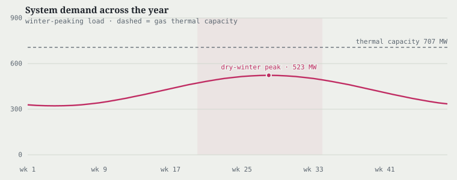
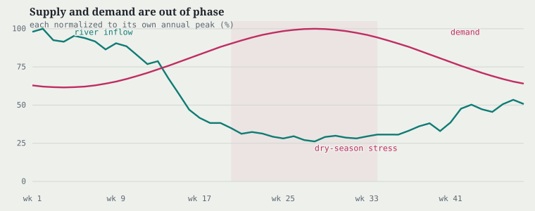

# The Bolivian interconnected system

```@meta
CurrentModule = DecisionRules
```

The hydrothermal case study runs on a model of Bolivia's **Sistema
Interconectado Nacional (SIN)** — a weekly planning problem on the
country's real grid topology and hydrology. The instance is hard in the
ways real systems are hard: water that arrives out of phase with demand,
the heaviest load stacked on a meshed high-altitude mining core far from
both generation sources, and an AC network whose true delivery cost the
standard convex shortcut quietly misses. This chapter presents the system;
the underlying mathematics is [the previous chapter](@ref
"The long-term hydrothermal planning problem"), and the training and
evaluation walkthrough is [Hydropower Scheduling](@ref).

## One country, two worlds, one thin backbone

The SIN model is small enough to reason about and awkward enough to be
interesting: **28 buses, 31 lines** (four genuine cycles), **934 MW** of
installed capacity — **707 MW gas thermal, 227 MW hydro** — and
**11 reservoirs**, solved in weekly stages over a horizon of roughly two
and a half years.


Geography sets the trap. Cheap **gas generation** sits east, in the Santa
Cruz lowlands where the gas fields are. The **hydro plants and the only
seasonal storage** sit high in the central Andes to the west, near
Cochabamba and La Paz. And the heaviest, least flexible **load** sits
somewhere else again: the highland mining belt around Potosí and Sucre.
The three are joined by a long, **high-impedance backbone** — mean
resistance-to-reactance ratio ``r/x \approx 0.26``, voltages held inside
``\pm 10\%``, and several genuine loops. Storing water where it rains and
spending it where it is mined means *pushing energy across a congested
mesh*; that is where the AC physics bites. This is not a textbook radial
feeder: losses, reactive support, and voltage margins all bind.

| System facts | |
|:---|---:|
| Buses / branches | 28 / 31 |
| Network cycles | 4 |
| Gas thermal capacity (east) | 707 MW |
| Hydro capacity (Andes) | 227 MW |
| Reservoirs (cascade links) | 11 (3) |
| Mean ``r/x`` | 0.26 |
| Voltage band | ``\pm 10\%`` |

## The water: seasonal, and never certain

Andean rivers are sharply seasonal. Energy-weighted system inflow peaks in
the wet austral summer (around week 2 of the annual cycle) and falls by a
factor of roughly **3.8** to the dry mid-winter trough (around week 28) —
and the forecast fans out across **15 spatially correlated historical
scenarios** every week.


The storage that must absorb this cycle is concentrated: one large
seasonal reservoir (**COR**, capacity ``\approx 138`` hm³, feeding the
downstream run-of-river plant SIS) dominates the system's carry-over
capability, with the remaining reservoirs holding days-to-weeks of water.
COR is a bank filled in the wet months and spent in the dry ones — but
every release is committed before the operator knows how dry the coming
winter will be.

## The load: out of phase, and concentrated

Two properties make the demand side hard, and both are features of the
real Bolivian system rather than dials turned for effect.

**1 — Out of phase.** Bolivian consumption climbs through the dry
winter — the mining and pumping season — and peaks in the very weeks the
rivers run lowest. Supply and demand are almost perfectly
counter-cyclical: the system must serve its annual maximum from its annual
hydrological minimum.




**2 — Concentrated.** A large share of national load sits on two adjacent
buses in the highland mining belt around Potosí (Cerro Rico, San
Cristóbal) — a meshed pocket at the far, high-impedance end of the grid,
and nowhere near the storage. Under a full AC model, delivering that much
power into a stressed, cyclic pocket costs real money in losses, reactive
support, and voltage margin; under a convex relaxation, much of that cost
is invisible.

!!! note "Demand calibration"
    The seasonal per-bus demand profile ships with the case as
    `examples/HydroPowerModels/bolivia/demand.csv` (a 48-week annual
    cycle, tiled across the horizon) and is the instance's calibrated
    design parameter: the case ships as a family of demand archetypes
    ranging from a mining-concentrated regime (widest relaxation gap) to
    a lowland-led one (nearly tight), each a plausible growth future of
    the real system. Quantitative statements that depend on the demand
    profile — peak/trough megawatts, the concentration share, and the
    measured relaxation gap — are properties of the shipped calibration
    and are reported, together with the regenerated results, in the
    [walkthrough](@ref "Hydropower Scheduling"); this chapter keeps them
    symbolic. Feasibility of the concentrated dry-season regime with zero
    load shedding under perfect foresight is verified on the full
    126-stage AC deterministic equivalent.

## Why it is a real test

**The physics the shortcut misses.** Multistage hydro planning is almost
always made tractable the same way: build a convex value-of-water function
by backward recursion, which requires a convex network model, so the true
AC power flow is swapped for a second-order-cone relaxation — exact on
radial, lightly loaded grids. Bolivia is neither. Meshed cycles, high
``r/x``, tight voltage bands, and a dry season that stacks the load on the
highland core put the instance squarely in the regime where the relaxation
**underprices the true AC cost of delivery** — mildly in the lowland-led
regime, materially in the concentrated one. A value of water computed on
that surrogate is priced against a system that does not quite exist. This
is not a defect of any solver; it is a property of the network — a regime
where fidelity to the AC physics changes the answer. The measured
**bound-versus-forward gap** (see
[The bound and the forward cost](@ref)) quantifies it per configuration.

**Why planning beats a greedy dispatch.** A myopic operator — minimize
this week, ignore the future — fails here in the three structural ways
derived in [the problem chapter](@ref
"Why this is a planning problem: the value of water"): stored water is
priced at zero exactly when its replacement cost is a distant gas peaker;
the congestion relief that stored hydro can provide to the mining core is
locational and visible only by looking ahead; and each release is
committed against a 15-scenario fan, which a plan hedges and a greedy rule
bets against.

Put together, the optimal policy here is a genuine **closed-loop plan**:
bank wet-season water, carry it across the mesh to meet the dry-season
peak on the mining core, and hedge the whole schedule against an uncertain
forecast — all while respecting the real AC network rather than a convex
surrogate of it. That conjunction — storage-critical, stochastic,
network-constrained, nonconvex — is exactly the problem class
DecisionRules.jl targets, and it is why this system serves as the
package's flagship case study.

!!! note "On the case data"
    The instance is built from the real SIN topology, generator fleet,
    and historical Andean inflow records (the
    [HydroPowerModels.jl](https://github.com/psrenergy/HydroPowerModels.jl)
    Bolivia case). The map's outline is the real national boundary; node
    placement is schematic (each bus positioned by its role and real
    city, with satellite markers fanning generation, storage, and load
    off each node so multiple quantities stay legible). Generation,
    storage, and load totals, the network statistics, the 15 joint inflow
    scenarios, and the seasonal demand shape are the model's own data.
