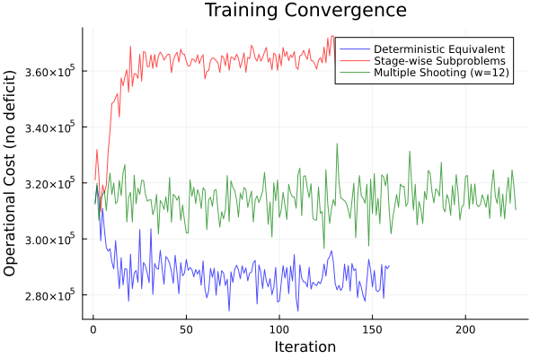
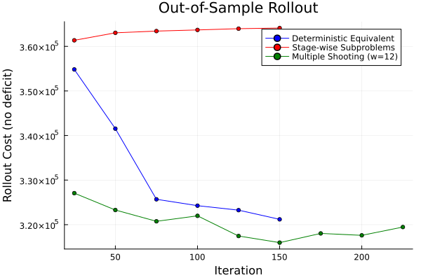
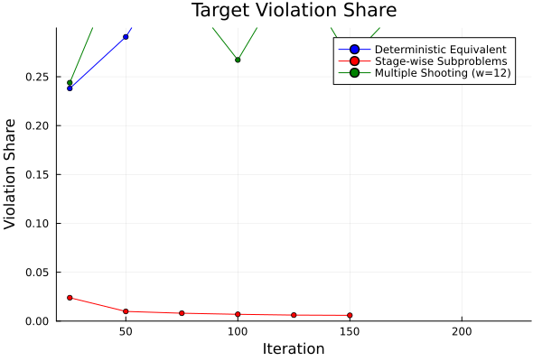
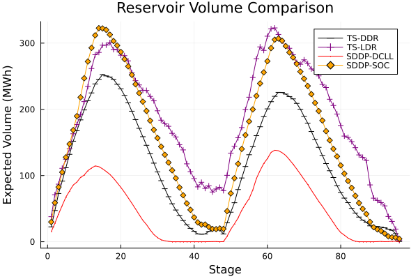
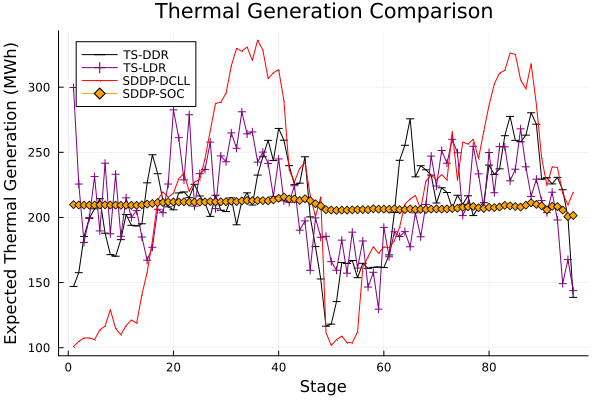

```@meta
EditURL = "hydro.jl"
```

# Hydropower Scheduling

This example trains target-setting decision rules for the Bolivia
long-term hydrothermal dispatch (LTHD) problem — both **TS-DDR** (deep,
LSTM-based) and **TS-LDR** (linear) — and compares them against an SDDP
baseline with inconsistent formulations.

The Bolivia system has **10 hydro plants**, **96 monthly stages**, and
**AC power flow** constraints.  Inflow uncertainty is sampled from 47
historical scenarios.

## Overview of the TS-DDR approach

Classical stochastic programming (e.g., SDDP) constructs piecewise-linear
value-function approximations.  TS-DDR takes a different route: a neural
network policy ``\pi_\theta`` maps observations to **target states**, and a
projection subproblem at each stage enforces physical feasibility while
tracking those targets as closely as possible.

The key insight is that the gradient of the projection subproblem with
respect to the target parameters is available through Lagrange duality
(or equivalently, implicit differentiation of the KKT conditions).
This avoids differentiating through the full optimization solver.

## Problem formulation

At each stage ``t``, the operator observes inflows ``w_t`` and the current
reservoir state ``x_{t-1}``.  The policy predicts target volumes:

```math
\hat{x}_t = \pi_\theta(w_{1:t},\, x_{t-1}).
```

A stage subproblem projects onto the feasible set:

```math
\begin{aligned}
q_t(x_{t-1},\, w_t;\; \hat{x}_t)
  \;=\;
  \min_{x_t, u_t, \delta_t}
  \quad &
  c_t(x_t, u_t) + C_\delta\, \|\delta_t\| \\
\text{s.t.}\quad
  & x_t = x_{t-1} + w_t - \text{turbined}_t - \text{spilled}_t,
        && \text{(reservoir balance)} \\
  & x_t + \delta_t = \hat{x}_t,
        && : \lambda_t \quad \text{(target constraint)} \\
  & \text{AC-OPF}(u_t),
        && \text{(power flow)}  \\
  & x_t \in [0, \bar{x}],\; u_t \ge 0.
\end{aligned}
```

The slack variable ``\delta_t`` absorbs infeasible targets; ``\lambda_t`` is
the dual multiplier that provides the gradient signal.

## Gradient computation: the envelope theorem

By the envelope theorem, the sensitivity of the optimal value with respect
to the target parameter is simply the dual:

```math
\frac{\partial q_t}{\partial \hat{x}_t}
\;=\; -\lambda_t.
```

Combined with backpropagation through the policy network, the full gradient
of the expected cost is:

```math
\nabla_\theta \mathbb{E}[Q]
\;\approx\;
\frac{1}{S} \sum_{s=1}^{S} \sum_{t=1}^{T}
  \lambda_t^s \odot \nabla_\theta \hat{x}_t^s(\theta),
```

where ``S`` is the number of sampled trajectories per batch and ``\odot``
denotes elementwise multiplication.

## Problem setup

The JuMP subproblems are built from a MOF file (exported from PowerModels.jl)
plus hydro data (reservoir limits, inflow scenarios).  Each subproblem contains:
- AC optimal power flow constraints
- Reservoir balance: `vol_out = vol_in + inflow - turbined - spilled`
- Target-slack deficit variables penalizing deviation from the policy's targets

The helper `build_hydropowermodels` reads the case data, creates one JuMP model
per stage, and parameterizes the initial volumes and inflows so they can be set
at each training sample.

````@example hydro
using DecisionRules
using JuMP, DiffOpt, Ipopt
using Flux
using Statistics, Random
````

Load the problem builder (reads MOF + hydro JSON + inflow CSV).

```julia
include("load_hydropowermodels.jl")
```

## Building the stage-wise subproblems

Each subproblem is wrapped with `DiffOpt.diff_optimizer` so that Lagrange duals
and implicit sensitivities are available for training.

```julia
diff_optimizer = () -> DiffOpt.diff_optimizer(
    optimizer_with_attributes(Ipopt.Optimizer, "print_level" => 0, "linear_solver" => "mumps")
)

subproblems, state_params_in, state_params_out, uncertainty_samples, initial_state, max_volume =
    build_hydropowermodels(
        "bolivia", "ACPPowerModel.mof.json";
        num_stages=96,
        optimizer=diff_optimizer,
        penalty_l1=:auto, penalty_l2=:auto,
    )
```

## Policy architecture

The policy is a [`StateConditionedPolicy`](@ref) with two components:

1. **Encoder** — a stack of LSTM cells that processes only the uncertainty
   (inflow) sequence, capturing temporal dependencies across stages.
2. **Combiner** — a Dense layer that merges the encoded uncertainty with the
   previous state to produce the next target.

At each stage the policy receives ``[w_t;\; x_{t-1}]`` and outputs
target reservoir volumes ``\hat{x}_t``:

```
 ┌─────────┐      ┌────────────────┐      ┌──────────────┐
 │   w_t   │─────▶│  LSTM encoder  │─────▶│              │
 └─────────┘      └────────────────┘      │    Dense     │──▶ x̂_t
 ┌─────────┐                              │   combiner   │
 │ x_{t-1} │─────────────────────────────▶│              │
 └─────────┘                              └──────────────┘
```

The LSTM carries hidden state across stages, giving the policy memory of
past inflows.  The activation is `sigmoid` (bounding outputs to ``[0,1]``,
which is then scaled by the feasibility mapping).

```julia
models = state_conditioned_policy(
    num_uncertainties, num_hydro, num_hydro, [128, 128];
    activation=sigmoid, encoder_type=Flux.LSTM,
)
```

## TS-LDR: Linear Decision Rules

As a baseline, we also train a **linear** policy (TS-LDR).  This uses
`dense_multilayer_nn` with identity activation — a composition of linear
layers equivalent to a single affine map:

```math
\hat{x}_t = W [w_{1:t};\; x_{t-1}] + b.
```

TS-LDR uses the same target-setting framework and training pipeline as
TS-DDR.  The only difference is the policy class: linear maps have fewer
parameters and cannot capture nonlinear inflow patterns, but they are a
natural baseline from the classical LDR literature.

```julia
num_inputs = DecisionRules.policy_input_dim(num_uncertainties, num_hydro)
models = dense_multilayer_nn(num_inputs, num_hydro, [64, 64]; activation=identity)
```

## Training pipeline 1: Deterministic Equivalent

The deterministic equivalent (DE) couples all 96 stages into a **single NLP**
for each sampled trajectory.  This is the most direct formulation: the policy
generates the full target trajectory ``\hat{x}_{1:T}`` in one forward pass,
and a single coupled solve determines all realized states simultaneously.

### How it works

```
 ┌──────────────────────────────────────────────────────────┐
 │  For each sampled trajectory w_{1:T}:                    │
 │                                                          │
 │  1. Forward pass: x̂_{1:T} = π_θ(w_{1:T}, x_0)          │
 │                                                          │
 │  2. Solve coupled NLP:                                   │
 │     min  Σ_t c_t(x_t, u_t) + C_δ Σ_t ‖δ_t‖             │
 │     s.t. dynamics + AC-OPF for ALL stages simultaneously │
 │          x_t + δ_t = x̂_t(θ)   ∀t  (target constraint)  │
 │                                                          │
 │  3. Read duals λ_t of target constraints                 │
 │     Gradient: Σ_t λ_t ⊙ ∇_θ x̂_t(θ)                     │
 └──────────────────────────────────────────────────────────┘
```

### Mathematical formulation

```math
\begin{aligned}
Q(w;\, \theta)
  \;=\;
  \min_{\{x_t, u_t, \delta_t\}_{t=1}^{T}}
  \quad &
  \sum_{t=1}^{T} c_t(x_t, u_t)
  + C_\delta \sum_{t=1}^{T} \|\delta_t\| \\
\text{s.t.}\quad
  & x_t = T_t(w_t,\, u_t,\, x_{t-1}),
        && t=1,\ldots,T \\
  & x_t + \delta_t = \hat{x}_t(\theta),
        && : \lambda_t,\quad t=1,\ldots,T \\
  & h_t(x_t, u_t) \ge 0,
        && t=1,\ldots,T
\end{aligned}
```

The gradient is exact by the envelope theorem:

```math
\nabla_\theta Q
\;=\;
\sum_{t=1}^{T}
\lambda_t \odot \nabla_\theta \hat{x}_t(\theta).
```

**Advantages**: strongest gradient signal — full cross-stage coupling
captures how a target at stage 3 affects costs at stage 50.

**Disadvantage**: the NLP has ``96 \times (\text{AC-OPF variables})``
decision variables; the policy generates targets without seeing realized
states (open-loop target generation).

```julia
det_equivalent, uncertainty_samples_det = DecisionRules.deterministic_equivalent!(
    det_model, subproblems_de, state_params_in, state_params_out,
    Float64.(initial_state), uncertainty_samples,
)

train_multistage(
    models, initial_state, det_equivalent,
    state_params_in, state_params_out, uncertainty_samples;
    num_batches=4000, optimizer=Flux.Adam(),
    penalty_schedule=[(1,100,0.1), (101,210,1.0), (211,300,10.0), (301,4000,30.0)],
)
```

## Training pipeline 2: Stage-wise Decomposition (Single Shooting)

Stage-wise decomposition solves one subproblem per stage sequentially.
Unlike the DE, the policy operates in **closed loop**: after each stage
solve, the realized state ``x_t`` (not the predicted target) is fed back
as input to the next stage.

### How it works

```
 ┌─────────────────────────────────────────────────────────────┐
 │  For each sampled trajectory w_{1:T}:                       │
 │                                                             │
 │  x_0 = initial state                                        │
 │  for t = 1, ..., T:                                         │
 │      x̂_t = π_θ(w_t, x_{t-1})          ← predict target     │
 │      solve stage-t subproblem          ← project to feasible│
 │      x_t = realized state from solver  ← closed-loop        │
 │      accumulate c_t + C_δ ‖δ_t‖                             │
 │                                                             │
 │  Gradient: chain rule through all stage solves               │
 └─────────────────────────────────────────────────────────────┘
```

### Gradient chain

The gradient must account for how the realized state at stage ``t``
depends on the targets at all earlier stages.  By the chain rule:

```math
\frac{\partial Q}{\partial \hat{x}_t}
\;=\;
\lambda_t
+ \sum_{k>t}
  \frac{\partial q_k}{\partial x_{k-1}}
  \cdot \prod_{j=t+1}^{k-1}
  \frac{\partial x_j}{\partial x_{j-1}}
  \cdot \frac{\partial x_t}{\partial \hat{x}_t}.
```

In practice, automatic differentiation (Zygote + ChainRules `rrule`s
defined on each stage solve) handles this chain automatically.
The `rrule` for each stage solve reads the dual ``\lambda_t`` for the
target constraint and uses DiffOpt's implicit differentiation for the
state-transition sensitivities.

**Advantages**: closed-loop — the policy sees realized states, matching
deployment semantics.  Each solve is small (single-stage AC-OPF).

**Disadvantage**: gradients weaken over long horizons because the
chain rule multiplies many Jacobians; sequential solve prevents
parallelism.

```julia
train_multistage(
    models, initial_state, subproblems,
    state_params_in, state_params_out, uncertainty_samples;
    num_batches=3000, optimizer=Flux.Adam(),
    penalty_schedule=:default_annealed,
)
```

## Training pipeline 3: Multiple Shooting

Multiple shooting partitions the ``T``-stage horizon into ``K`` windows of
``W`` stages each.  Within each window, a local deterministic equivalent
couples the stages (strong gradient signal).  Between windows, the realized
end-state is passed to the next window (closed-loop continuity).

### How it works

```
 ┌────────────────────────────────────────────────────────────────┐
 │  Partition T=96 stages into K=⌈96/12⌉=8 windows of W=12      │
 │                                                                │
 │  x_0 = initial state                                           │
 │  for k = 1, ..., K:                                            │
 │      stages = [(k-1)W+1, ..., kW]                              │
 │      x̂_{stages} = π_θ(w_{stages}, x_{start_k})                │
 │      solve window-k DE (12-stage coupled NLP)                  │
 │      x_{end_k} = realized end-state from window solve          │
 │      x_{start_{k+1}} = x_{end_k}                               │
 │                                                                │
 │  Gradient:                                                     │
 │    Within window: duals from the coupled solve (like full DE)  │
 │    Across windows: DiffOpt chain rule through end-states       │
 └────────────────────────────────────────────────────────────────┘
```

### Gradient structure

Let ``Q_k`` be the cost of window ``k``.  The total cost is
``Q = \sum_k Q_k``.  Within a window, the gradient is identical to the
DE case (duals of the target constraints in the coupled model).  Across
windows, the chain rule threads through the realized end-state:

```math
\frac{dQ}{d\theta}
\;=\;
\sum_{k=1}^{K}
\left(
  \frac{\partial Q_k}{\partial \hat{x}_k}
  \cdot \frac{\partial \hat{x}_k}{\partial \theta}
  \;+\;
  \frac{\partial Q_k}{\partial x_{\text{start}_k}}
  \cdot \frac{d x_{\text{start}_k}}{d\theta}
\right),
```

where ``\frac{d x_{\text{start}_k}}{d\theta}`` involves the chain
through all prior windows via ``x_{\text{end}_{k-1}}``.

**Advantages**: balances gradient quality (12-stage coupling) with
tractability (8 small DEs instead of one large one); inter-window
chain provides some closed-loop signal.

**Disadvantage**: window boundaries introduce gradient discontinuities;
the full-horizon coupling is weaker than the single DE.

```julia
windows = DecisionRules.setup_shooting_windows(
    subproblems, state_params_in, state_params_out,
    Float64.(initial_state), uncertainty_samples;
    window_size=12,
    model_factory=() -> DiffOpt.nonlinear_diff_model(ipopt_attrs),
)

train_multiple_shooting(
    models, initial_state, windows, () -> uncertainty_samples;
    num_batches=3000, optimizer=Flux.Adam(),
    penalty_schedule=:default_annealed,
)
```

## Penalty annealing

The target penalty ``C_\delta`` controls the trade-off between following
the policy's targets and minimizing operational cost.  DecisionRules
supports a **penalty annealing schedule** that ramps the penalty multiplier
during training:

| Phase | Multiplier | Purpose |
|:------|:----------:|:--------|
| Warmup | ``0.1 \times C_\delta`` | Let the policy explore freely |
| Nominal | ``1.0 \times C_\delta`` | Standard training |
| Tighten | ``10.0 \times C_\delta`` | Sharpen target tracking |
| Lock | ``30.0 \times C_\delta`` | Final precision |

This is activated with `penalty_schedule=:default_annealed` or by passing
an explicit list of `(start_iter, end_iter, multiplier)` tuples.

## Evaluation

After training, we evaluate the policy using stage-wise rollout on held-out
scenarios.  Two modes:
- **Target feedback** (`policy_state=:target`): the policy receives its own
  predicted target as input, matching DE training semantics.
- **Realized feedback** (`policy_state=:realized`): the policy receives the
  realized state from the solver, matching deployment semantics.

The **target-violation share** measures how much cost comes from the slack
penalty rather than actual operations — it should be small (``\le 5\%``) for
a well-trained policy.

```julia
rollout_eval = RolloutEvaluation(
    subproblems, state_params_in, state_params_out, initial_state, eval_scenarios;
    stride=1, policy_state=:realized,
)
rollout_eval(1, models)
println("Operational cost: ", rollout_eval.last_objective_no_deficit)
println("Violation share:  ", rollout_eval.last_violation_share)
```

## SDDP baseline

For comparison, we also train an SDDP policy using
[SDDP.jl](https://github.com/odow/SDDP.jl) with **inconsistent
formulations**: a convex SOC-WR relaxation for the backward pass
(cut generation) and the nonconvex ACP formulation for the forward
pass (simulation).  This is a pragmatic approach when the true problem
(AC-OPF) is nonconvex — SDDP requires convexity for valid cuts, so a
convex relaxation approximates the value function while the forward pass
evaluates under the true physics.

The SDDP policy is trained for up to 2000 iterations and the learned
cuts are saved to a JSON file, which can be loaded to simulate the
policy under the ACP formulation.

## Results

The plots below compare the TS-DDR and TS-LDR training formulations and
the SDDP baseline on the Bolivia case.  Training curves, out-of-sample
cost distributions, reservoir volume trajectories, and thermal generation
profiles are shown.

### Training convergence (TS-DDR methods)



### Out-of-sample cost (TS-DDR methods)



### Target-violation share (TS-DDR methods)



### Reservoir volume comparison (all methods)



### Thermal generation comparison (all methods)



### Summary

The TS-DDR costs below are from 100-scenario out-of-sample evaluations
using `evaluate_hydro_policies.jl` (operational cost excluding
target-deficit penalty).  The SDDP cost is from the same 100
out-of-sample simulation protocol.

| Method | Policy | Mean Cost | Std | N | Notes |
|:-------|:------:|----------:|----:|--:|:------|
| TS-DDR (DE) | LSTM | 325 540 | 6 266 | 100 | Coupled horizon, open-loop targets |
| TS-DDR (DE, anneal) | LSTM | 324 445 | 6 134 | 100 | Penalty annealing helps slightly |
| TS-DDR (shooting w=12) | LSTM | 323 289 | 5 593 | 100 | Windowed coupling |
| TS-DDR (shooting w=12, anneal) | LSTM | 322 812 | 6 081 | 100 | Best shooting variant |
| TS-DDR (stage-wise, anneal) | LSTM | **321 543** | 6 214 | 100 | **Best TS-DDR** |
| SDDP (SOC-WR / ACP) | cuts | **303 684** | — | 100 | 126 stages (96 + 30 margin) |

The subproblems method with penalty annealing achieves the best TS-DDR
cost (321 543), about 5.9% above SDDP (303 684).  Penalty annealing
is essential for the subproblems method: without it, the cost jumps to
368 498.  All three methods with annealing converge to similar costs
(321K–325K range), with subproblems slightly ahead.

SDDP with inconsistent formulations provides a strong baseline: it
leverages convex cuts and trains on **126 stages** (96 real + 30 margin),
giving its value function foresight beyond the evaluation horizon.
TS-DDR trains on 96 stages only.  Extending to 126 stages and training
longer may close part of the remaining gap.

