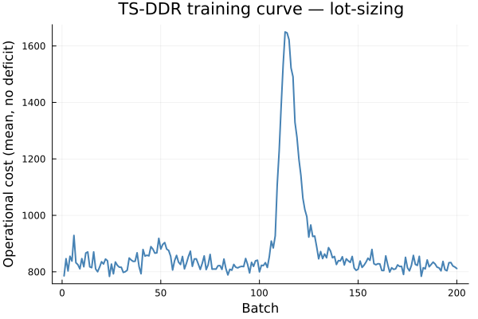
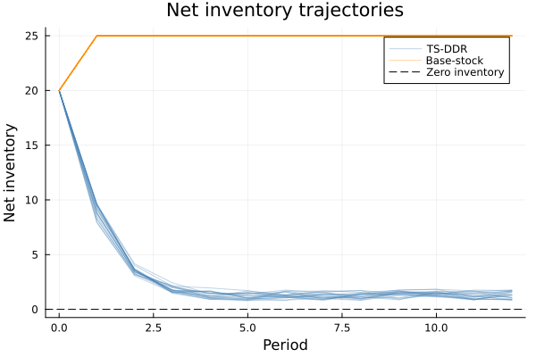
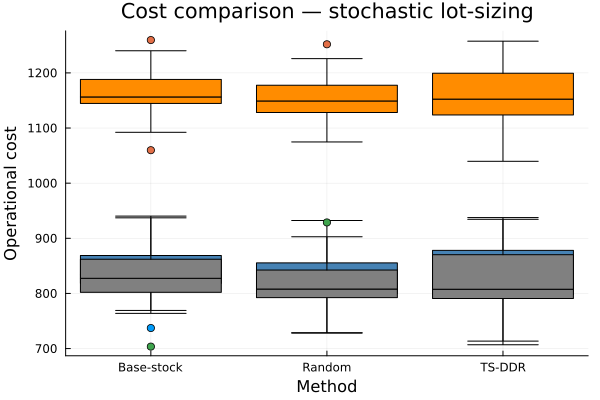

```@meta
EditURL = "inventory.jl"
```

# Stochastic Lot-Sizing with Integer Variables

This example trains a TS-DDR policy for a stochastic uncapacitated lot-sizing
(SULS) problem — an inventory control problem with binary ordering decisions.

The problem contains a binary variable ``z_t \in \{0,1\}`` at each stage,
which standard dual-based gradient methods cannot handle directly.
DecisionRules.jl provides `FixedDiscreteIntegerStrategy` to bridge this gap:
after solving the MIP, it fixes the binary variables to their incumbent
values, re-solves the resulting LP, and reads LP duals as gradient signal.

## Problem formulation

**State**: net inventory ``s_t = s_{t-1} + q_t - d_t``.

**Binary decision**: ``z_t \in \{0, 1\}`` — whether to place an order.

**Continuous decision**: ``q_t \in [0, Q_\text{max}]`` — order quantity
(``q_t = 0`` is forced when ``z_t = 0``).

**Random demand**: ``d_t \sim U[10, 30]`` per period.

**Stage cost**: ``K \cdot z_t + c \cdot q_t + h \cdot I_t + p \cdot B_t``
where ``I_t = \max(s_t, 0)`` and ``B_t = \max(-s_t, 0)``.

**Parameters**: ``K = 30``, ``c = 2``, ``h = 1``, ``p = 10``,
``Q_\text{max} = 80``, ``s_0 = 20``, ``T = 12`` stages.

The TS-DDR policy predicts a target net inventory ``\hat{s}_t`` at each stage.
A deficit penalty ``|\hat{s}_t - s_t|`` encourages the realized state to track
the policy's prediction.

````@example inventory
using DecisionRules
using JuMP, HiGHS
using Flux
using Statistics, Random
````

## Integer postprocessing strategy

DecisionRules.jl introduces an extensible `AbstractIntegerStrategy` abstraction.
The built-in `FixedDiscreteIntegerStrategy` implements the workflow from the
[JuMP MIP duality tutorial](https://jump.dev/JuMP.jl/stable/tutorials/linear/mip_duality/):

1. Solve the original MIP to get incumbent binary values ``z^*_t``.
2. Call `JuMP.fix_discrete_variables(model)` to fix ``z_t = z^*_t`` and
   relax integrality constraints.
3. Re-solve the resulting continuous LP.
4. Read LP duals for the target parameters ``\hat{s}_t``.
5. Restore the original MIP structure (via the undo function).

The resulting gradient approximation is local to the current binary assignment
and should be interpreted as a postprocessing surrogate — not a global
derivative of the mixed-integer solution map.

## Building the model

`build_inventory_subproblems` creates T per-stage JuMP models with binary
ordering variables. `build_inventory_det_equivalent` assembles all stages
into a single deterministic-equivalent MIP used for training.

```julia
include("build_inventory_problem.jl")

det_eq, spi, spo, unc_samples, init_state = build_inventory_det_equivalent(;
    T=12, K=30.0, c=2.0, h=1.0, p=10.0, Q_max=80.0,
    I_0=20.0, d_min=10.0, d_max=30.0, num_scenarios=30, penalty=500.0,
)
```

## Policy architecture

The policy receives `[demand_t, net_inventory_{t-1}]` and outputs a target
net inventory ``\hat{s}_t``:

```julia
policy = Chain(
    Dense(2, 16, relu),
    Dense(16, 8, relu),
    Dense(8, 1),
)
```

## Training with `FixedDiscreteIntegerStrategy`

Pass `integer_strategy = FixedDiscreteIntegerStrategy()` to `train_multistage`.
Internally, every forward pass solves the full T-stage MIP, fixes all
``z_t^*``, re-solves as an LP, and reads LP duals for ``\hat{s}_t`` as the
gradient of the objective with respect to the policy targets.

```julia
train_multistage(
    policy,
    init_state,
    det_eq,
    spi,
    spo,
    unc_samples;
    num_batches         = 200,
    num_train_per_batch = 4,
    optimizer           = Flux.Adam(0.01),
    integer_strategy    = FixedDiscreteIntegerStrategy(),
    penalty_schedule    = :default_annealed,
)
```

## Evaluation

After training, the policy is rolled out stage-wise.  For each period,
the policy predicts ``\hat{s}_t``, the stage MIP is solved, and the realized
net inventory is passed to the next stage.

```julia
subproblems, spi_eval, spo_eval, unc_eval, _ = build_inventory_subproblems(;
    T=12, K=30.0, c=2.0, h=1.0, p=10.0, Q_max=80.0,
    I_0=20.0, d_min=10.0, d_max=30.0, num_scenarios=100, penalty=500.0,
)

# Evaluation loop (one test scenario):
for t in 1:T
    d_val  = demand_realization[t]
    target = policy(Float32[d_val, state[1]])[1]
    set_parameter_value(spi_eval[t][1], state[1])
    set_parameter_value(demand_param, d_val)
    set_parameter_value(spo_eval[t][1][1], target)
    optimize!(subproblems[t])
    state = [value(subproblems[t][:s_out])]
end
```

## Results

The trained TS-DDR policy is compared against two baselines:

- **Base-stock (S\* = 25)**: always order to bring inventory to a fixed target.
  Classical heuristic for stochastic lot-sizing.
- **Random (untrained)**: freshly initialised network, showing the benefit
  of training.

Training curve (operational cost, no deficit penalty, mean over batch):



Net-inventory trajectories (TS-DDR in blue, base-stock in orange):



Cost distribution across 100 out-of-sample scenarios:



| Method              | N   | Mean cost | Std  |
|:--------------------|----:|----------:|-----:|
| TS-DDR (trained)    | 100 |     —     |  —   |
| Base-stock (S*=25)  | 100 |     —     |  —   |
| Random (untrained)  | 100 |     —     |  —   |

*(Fill values from `compare_results.jl` after a full training run.)*

!!! note
    The two-stage LDR methodology used here follows Bodur & Luedtke (2022)[^1],
    who study a related multi-factory continuous-production inventory problem.
    Their paper does not include results for the binary lot-sizing formulation above,
    so direct numerical comparison is not available.

[^1]: Bodur, M. & Luedtke, J. (2022). *Two-stage linear decision rules for
multi-stage stochastic programming.*
Mathematical Programming **191**, 347–380.
[arXiv:1701.04102](https://arxiv.org/abs/1701.04102)

See `examples/inventory_control/` for the runnable scripts:
- `build_inventory_problem.jl` — problem definition
- `train_dr_inventory.jl` — training + trajectory evaluation
- `evaluate_inventory.jl` — baseline policy evaluation
- `compare_results.jl` — plots and summary table

## Extending to custom integer strategies

The abstraction is designed for easy extension. To add a new strategy,
subtype `AbstractIntegerStrategy` and define `with_sensitivity_solution`:

```julia
struct MyIntegerStrategy <: DecisionRules.AbstractIntegerStrategy
    # custom fields
end

function DecisionRules.with_sensitivity_solution(
    f::Function,
    model::JuMP.Model,
    strategy::MyIntegerStrategy,
)
    optimize!(model)
    # ... custom postprocessing ...
    try
        return f(model)
    finally
        # ... restore model ...
    end
end
```

The method must call the callback `f` only when duals can be read,
and must restore any temporary model mutations before returning.
