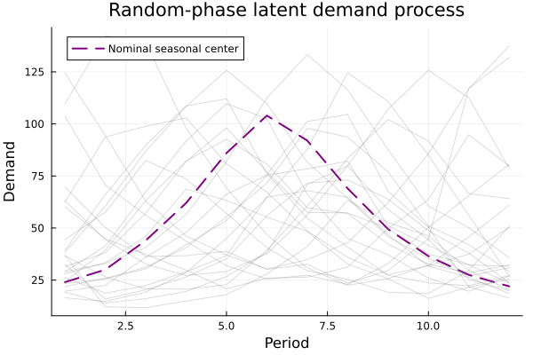
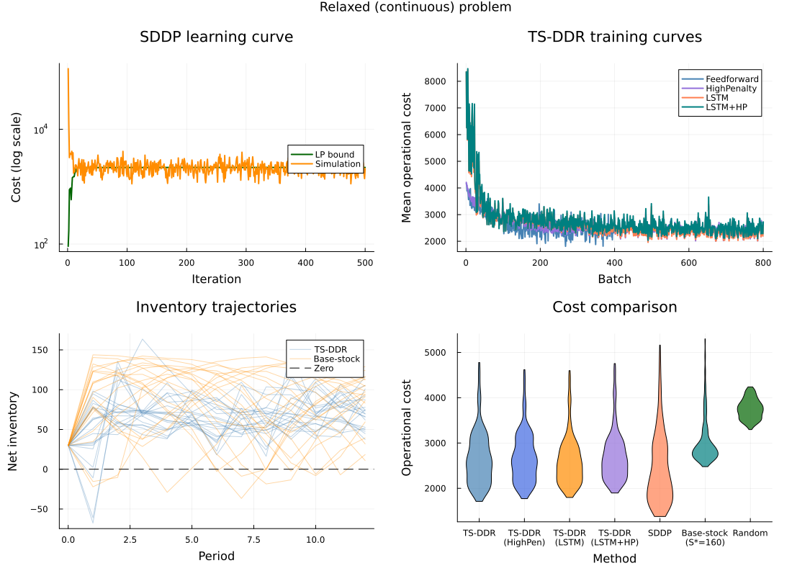
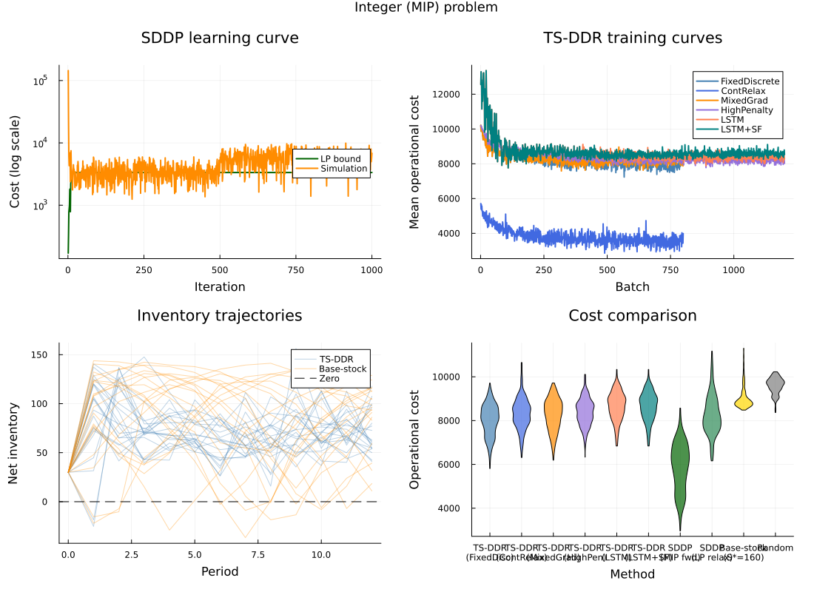

```@meta
EditURL = "inventory.jl"
```

# Stochastic Lot-Sizing with Fixed Ordering Costs

This example shows how to train target-state decision rules for a stochastic
inventory problem with ex-ante ordering decisions.

The example has two purposes:

1. show the complete optimization model before discussing implementation
   details; and
2. show the code in the same order a reader would run it.

````@example inventory
using DecisionRules
using Flux
using HiGHS
using JuMP
using Random
using Statistics
````

The runnable experiment lives outside the documentation tree. The file defines
the demand process, JuMP builders, and policy architecture used below.

````@example inventory
include(joinpath(@__DIR__, "..", "..", "..", "examples", "inventory_control",
    "build_inventory_problem.jl"))
````

## Information Pattern

At the beginning of period `t`, the controller knows

```math
x_t = (s_{t-1}, d_{t-1}, d_{t-2}),
```

where `s` is net inventory and `d` is realized demand. The controller chooses
the order quantity before seeing current demand `d_t`. This is an ex-ante
decision.

The neural policy receives `[d_t, x_t...]` during training because
DecisionRules policies output target states after the stage uncertainty is
sampled. The implementation below uses that target only to guide the
optimization model; the actual order still respects the model's information
pattern.

## Complete Stage Model

For each period `t = 1, ..., T`, the stage model is

```math
\begin{aligned}
\min_{q_t,z_t,s_t^{mid},s_t,h_t,b_t}
    \quad & K z_t + c q_t + h h_t + p b_t
            + \lambda |s_t^{mid} - \hat{s}_t| \\
\text{s.t.}\quad
    & 0 \le q_t \le Q_{\max} z_t, && \text{(1) order capacity} \\
    & z_t \in \{0,1\},             && \text{(2) setup decision} \\
    & s_t^{mid} = s_{t-1} + q_t,   && \text{(3) order arrives} \\
    & s_t = s_t^{mid} - d_t,       && \text{(4) demand realizes} \\
    & h_t - b_t = s_t,             && \text{(5) inventory split} \\
    & h_t \ge 0,\; b_t \ge 0.      && \text{(6) split bounds}
\end{aligned}
```

The relaxed model removes (2) and replaces (1) by
``0 \le q_t \le Q_{\max}``; it also removes the fixed cost `K z_t` from the
objective.

The target `\hat{s}_t` is not an operational requirement. It is the state
target produced by the neural decision rule, and the penalty term gives the
policy a gradient signal.

## Parameters

````@example inventory
inventory_parameters = (
    T = INVENTORY_T,
    setup_cost = INVENTORY_K,
    unit_order_cost = INVENTORY_C,
    holding_cost = INVENTORY_H,
    backlog_cost = INVENTORY_P,
    order_capacity = INVENTORY_Q_MAX,
    initial_inventory = INVENTORY_I0,
    target_penalty = INVENTORY_PENALTY,
)
````

## Demand Process

Demand has a hidden seasonal phase, a persistent hidden regime, and an AR(1)
shock:

```math
\epsilon_t = 0.92 \epsilon_{t-1} + 0.35 \eta_t,
```

```math
d_t =
\operatorname{clip}\!\left(
    m_{\kappa_t}
    + w_{\kappa_t}(0.85 r_t + 0.42 \epsilon_t + 0.12 \eta'_t)
\right),
```

where `r_t` is the hidden regime and
``\kappa_t = 1 + ((t + \phi - 1) \bmod T)`` is the hidden seasonal index.

````@example inventory
Random.seed!(11)
demand_paths = [sample_inventory_demand_path() for _ in 1:3]
````

## Build the Continuous and Integer Models

The builders return the JuMP model(s), input-state parameters, output-target
parameters, an uncertainty sampler, and the initial state.

````@example inventory
relaxed_subproblems,
relaxed_state_in,
relaxed_state_out,
relaxed_sampler,
initial_state = build_inventory_subproblems(;
    num_scenarios = 100,
    integer = false,
)

integer_subproblems,
integer_state_in,
integer_state_out,
integer_sampler,
_ = build_inventory_subproblems(;
    num_scenarios = 100,
    integer = true,
)
````

The deterministic equivalent is the full-horizon model used by direct
transcription training.

````@example inventory
integer_det_equivalent,
integer_det_state_in,
integer_det_state_out,
integer_det_sampler,
_ = build_inventory_det_equivalent(;
    num_scenarios = 50,
    integer = true,
)
````

## Integer Sensitivity Strategies

Mixed-integer models do not have ordinary LP duals. DecisionRules therefore
makes the chosen postprocessing strategy explicit.

````@example inventory
fixed_discrete = FixedDiscreteIntegerStrategy()
continuous_relaxation = ContinuousRelaxationIntegerStrategy()
````

`FixedDiscreteIntegerStrategy` solves the MIP, fixes the incumbent integer
variables, re-solves the fixed LP, and reads local dual information.

`ContinuousRelaxationIntegerStrategy` relaxes integer variables first and reads
duals from the relaxed LP. This is smoother and faster, but the gradient is for
the relaxation, not for an integer-feasible decision.

## Score-Function Correction

Local LP duals do not see a discrete switch such as "open the setup variable".
A score-function correction estimates the effect of target changes by solving
perturbed integer rollouts:

```math
\nabla L
=
\alpha \nabla L_{\mathrm{dual}}
+ (1-\alpha)
  \frac{1}{M}
  \sum_{m=1}^{M}
  (R_m - b)
  \nabla_\theta
  \sum_{t=1}^{T}
  \left\langle
      \delta_{m,t}/\sigma^2,
      \hat{x}_{t+1}(\theta)
  \right\rangle .
```

There are two different solves in the mixed-gradient training loop:

- `train_multistage(...; integer_strategy = fixed_discrete)` controls the
  deterministic-equivalent solve used for the dual-gradient term
  ``\nabla L_{\mathrm{dual}}``. This solve needs a postprocessing strategy
  because duals are not directly defined for a MIP.
- `ScoreFunctionConfig(integer_subproblems, ...)` controls the Monte Carlo
  rollout term. These rollout models are solved exactly as they are built.
  Because `integer_subproblems` contain binary setup variables, the rollout
  costs `R_m` are true MIP rollout costs.

In short: `integer_strategy` is for reading local duals; score-function
rollouts are for measuring realized costs.

````@example inventory
score_function = ScoreFunctionConfig(
    integer_subproblems,
    integer_state_in,
    integer_state_out;
    dual_weight = 0.5,
    perturbation_std = 1.0,
    num_rollouts = 8,
)

score_schedule = ScoreFunctionSchedule(
    score_function;
    sf_start = 200,
    ramp_batches = 300,
    perturbation_std_initial = 0.1,
    num_rollouts_initial = 2,
)
````

## Policy

A DecisionRules policy is any callable `π(x) -> target` where `x` is the
concatenation `[uncertainty..., state...]` and `target` is the desired
next state. The only requirement is that it is differentiable via
`Zygote.gradient` and registered with `Functors.@functor` so that
`Flux.loadmodel!` can checkpoint its parameters.

### Feedforward policy

The simplest architecture is a feedforward MLP. This policy is ex-ante:
it ignores the current demand `d_t` (index 1) and uses only the state
entries `[inventory, d_{t-1}, d_{t-2}]`.

````@example inventory
using Functors: @functor

struct ExAntePolicy{N}
    net::N
end

@functor ExAntePolicy (net,)
````

The callable normalizes features to ≈[0,1] and maps through the network.
The sigmoid output bounds the target to `[0, 500]`.

````@example inventory
function (p::ExAntePolicy)(x)
    inventory = Float32(x[2])
    d_prev    = Float32(x[3])
    d_prev2   = Float32(x[4])
    features  = Float32[inventory / 100, d_prev / 100, d_prev2 / 100]
    target    = 500f0 .* Flux.sigmoid.(p.net(features))
    return Float32[target[1], x[1], d_prev]
end

Random.seed!(2024)
policy = ExAntePolicy(Chain(Dense(3, 32, relu), Dense(32, 24, relu), Dense(24, 1)))
````

### Recurrent (LSTM) policy

When the uncertainty process has temporal structure (regimes, trends,
seasonality), a recurrent encoder can learn patterns that a feedforward
MLP cannot detect from a fixed-length window.

The design below uses `Flux.LSTMCell` to process one *lagged* demand
value per stage. The LSTM hidden state accumulates across stages within
a scenario, then resets between scenarios via `Flux.reset!`.

The affine output `raw × 200 + 150` avoids sigmoid saturation and
centers the target on typical inventory levels.

````@example inventory
mutable struct RecurrentExAntePolicy{E,C,S}
    encoder::E
    combiner::C
    state::S
end

@functor RecurrentExAntePolicy (encoder, combiner)

function (p::RecurrentExAntePolicy)(x)
    d_prev    = Float32(x[3])
    inventory = Float32(x[2])
    d_prev2   = Float32(x[4])
    T = eltype(first(p.state))
    encoded, new_state = p.encoder(T[d_prev / 100], p.state)
    p.state = new_state
    raw = p.combiner(vcat(encoded, T[inventory / 100, d_prev2 / 100]))
    target = raw[1] * 200f0 + 150f0
    return Float32[target, x[1], d_prev]
end

function Flux.reset!(p::RecurrentExAntePolicy)
    p.state = Flux.initialstates(p.encoder)
    return nothing
end

Random.seed!(2024)
lstm_encoder = Flux.LSTMCell(1 => 16)
lstm_policy = RecurrentExAntePolicy(
    lstm_encoder,
    Dense(16 + 2, 1),
    Flux.initialstates(lstm_encoder),
)
````

## Training Calls

The continuous problem uses ordinary dual information.

```julia
train_multistage(
    policy,
    initial_state,
    relaxed_subproblems,
    relaxed_state_in,
    relaxed_state_out,
    relaxed_sampler;
    num_batches = 400,
    num_train_per_batch = 5,
    optimizer = Flux.Adam(0.0015),
    integer_strategy = NoIntegerStrategy(),
    penalty_schedule = [(1, 80, 0.4), (81, 400, 1.0)],
)
```

The integer deterministic-equivalent run uses the fixed-discrete local dual
path plus the scheduled score-function correction.

```julia
train_multistage(
    policy,
    initial_state,
    integer_det_equivalent,
    integer_det_state_in,
    integer_det_state_out,
    integer_det_sampler;
    num_batches = 800,
    num_train_per_batch = 10,
    optimizer = Flux.Adam(0.0008),
    integer_strategy = fixed_discrete,
    penalty_schedule = [(1, 120, 0.4), (121, 800, 1.0)],
    score_function = score_schedule,
)
```

## Evaluation

A trained policy should be evaluated by stage-wise rollout, because that is
the deployment semantics: solve one period, observe the realized next state,
then solve the next period.

````@example inventory
uncertainty_sample = sample(integer_sampler)
rollout_cost = simulate_multistage(
    integer_subproblems,
    integer_state_in,
    integer_state_out,
    initial_state,
    uncertainty_sample,
    policy;
    integer_strategy = fixed_discrete,
)
````

## Experiment Scripts

Each variant can be trained independently via SLURM or directly:

```bash
# Single variant
julia --project=. train_dr_inventory.jl integer_lstm

# All variants in parallel via SLURM
cd examples/inventory_control && bash launch_all.sh
```

Available variant tags: `relaxed`, `relaxed_lstm`, `relaxed_hp`,
`relaxed_lstm_hp`, `integer`, `integer_cr`, `integer_sf`, `integer_hp`,
`integer_lstm`, `integer_lstm_sf`.

After training, run the comparison script to regenerate tables and figures:

```bash
julia --project=. evaluate_inventory.jl
julia --project=. solve_sddp.jl
julia --project=. compare_results.jl
```

The figures used by this page are generated by `compare_results.jl`.







### Relaxed (continuous) results

SDDP uses a PAR(1) approximation of the true latent demand process, which
is not exact for this problem. Despite this advantage for TS-DDR, the gap
between the best TS-DDR variant and SDDP is ~7%.

The LSTM encoder closes ~25% of the gap versus the feedforward baseline by
learning temporal demand patterns from lagged observations.

| Method                          |   N | Mean cost |   Std | vs SDDP |
|:--------------------------------|----:|----------:|------:|--------:|
| SDDP (PAR)                      | 300 |    2434.0 |     — |   0.0%  |
| TS-DDR (LSTM)                   | 300 |    2610.6 | 540.3 |  +7.3%  |
| TS-DDR (feedforward)            | 300 |    2667.3 | 593.5 |  +9.6%  |
| TS-DDR (HighPenalty)            | 300 |    2677.5 | 547.0 | +10.0%  |
| TS-DDR (LSTM+HP)                | 300 |    2712.0 | 554.6 | +11.4%  |

### Integer (MIP) results

SDDP uses an `AlternativeForwardPass`: MIP in the forward pass, LP
relaxation in the backward pass for valid cuts. The TS-DDR gap is ~36%.

| Method                          |   N | Mean cost |   Std | vs SDDP |
|:--------------------------------|----:|----------:|------:|--------:|
| SDDP (MIP fwd)                  | 300 |    5871.6 |1087.4 |   0.0%  |
| TS-DDR (FixedDiscrete)          | 300 |    8015.8 | 718.3 | +36.5%  |
| TS-DDR (MixedGrad)              | 300 |    8268.0 | 715.3 | +40.8%  |
| TS-DDR (ContRelax)              | 300 |    8318.1 | 718.8 | +41.7%  |
| TS-DDR (HighPenalty)            | 300 |    8388.4 | 615.9 | +42.8%  |
| SDDP (LP relax)                 | 300 |    8274.2 | 912.5 | +40.9%  |
| Base-stock (S\*=160)            | 300 |    9035.6 | 506.8 | +53.9%  |
| Random (untrained)              | 300 |    9594.6 | 361.1 | +63.4%  |

