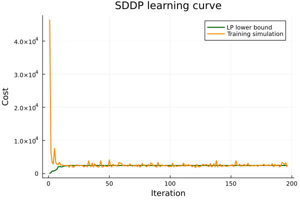

```@meta
EditURL = "inventory.jl"
```

# Inventory Control with Fixed Ordering Costs

This example is a finite-horizon inventory-control problem with the feature that
makes lot-sizing difficult in practice: placing an order has a fixed setup cost.
The controller therefore faces a genuine batching decision. It may be better to
order a large quantity now and carry inventory, or to skip an order and risk
backlog later.

The example is designed to stress methods that rely on stagewise-independent
uncertainty. Each simulated demand trajectory has a latent seasonal phase,
persistent high/low demand regimes, and autocorrelated shocks. The phase is
randomized independently across sample paths, so a method cannot solve the
problem by memorizing that a particular calendar period is always the peak.
Useful decisions require reacting to observed demand history.

## Information Pattern

At the start of period ``t``, the controller observes:

- current net inventory ``s_{t-1}``,
- the last two realized demands.

It does **not** observe the demand that will arrive in the current period.
The order decision is therefore ex-ante. After the order is placed, current
demand is realized and becomes part of the history available next period.

TS-DDR uses the same neural policy at every period. The policy is time-invariant:
it receives demand history and inventory, but not the period index.

## Inventory Model

The binary variable has the standard lot-sizing interpretation:

```math
z_t =
\begin{cases}
1, & \text{place an order in period } t,\\
0, & \text{do not place an order.}
\end{cases}
```

If ``z_t=0``, no units can be ordered. If ``z_t=1``, the model pays the fixed
setup cost ``K`` and may order up to capacity:

```math
0 \le q_t \le Q_{\max} z_t.
```

The ordered units arrive before demand:

```math
s^{mid}_t = s_{t-1} + q_t,
\qquad
s_t = s^{mid}_t - d_t.
```

Positive ``s_t`` is inventory on hand; negative ``s_t`` is backlog. The period
cost is

```math
K z_t + c q_t + h \max(s_t,0) + p \max(-s_t,0).
```

The numerical parameters are:

| Parameter | Value | Meaning |
|:--|--:|:--|
| ``T`` | 12 | periods |
| ``K`` | 100 | fixed order/setup cost |
| ``c`` | 2 | unit ordering cost |
| ``h`` | 1 | holding cost |
| ``p`` | 15 | backlog penalty |
| ``Q_{\max}`` | 200 | order capacity |
| ``s_0`` | 30 | initial inventory |

## TS-DDR Formulation

The TS-DDR policy predicts a pre-demand order-up-to target ``\hat{s}^{mid}_t``.
The mixed-integer subproblem chooses ``z_t`` and ``q_t`` to track that target
while respecting setup and capacity constraints. The target penalty is imposed on
``s^{mid}_t-\hat{s}^{mid}_t``, not on post-demand inventory.

Although current demand is present as an uncertainty parameter in the JuMP model,
the policy does not use it to choose the order target. The policy output has two
roles:

- choose the current pre-demand inventory target,
- copy realized demand into the state so it can be used next period.

The state carried between periods is:

```julia
[net_inventory, last_demand, previous_demand]
```

This lets a time-invariant policy infer the latent demand regime from recent
observations without receiving a period counter or synthetic seasonal features.

## Demand Process

Let ``\phi`` be a path-level phase shift, sampled uniformly from
``\{0,\ldots,T-1\}``, and let
``\kappa_t = 1 + ((t+\phi-1) \bmod T)`` denote the shifted seasonal index. The
nominal lower and upper seasonal bands are ``D^{lo}_{\kappa_t}`` and
``D^{hi}_{\kappa_t}``, with midpoint ``m_{\kappa_t}`` and half-width
``w_{\kappa_t}``.

Demand also contains a persistent latent regime ``r_t\in\{-1,0,1\}`` and an
autoregressive shock ``\epsilon_t``. In the implementation,

```math
\epsilon_t = 0.84\,\epsilon_{t-1}+0.35\,\eta_t,
\qquad
d_t =
\operatorname{clip}\!\left(
  m_{\kappa_t}
  + w_{\kappa_t}
    (0.78 r_t + 0.42 \epsilon_t + 0.12 \eta'_t)
\right),
```

where the regime is resampled with probability ``0.08`` each period. The phase,
regime, and shocks are not observed directly. The controller sees their effect
only through realized demand history.

The plot below shows 24 sampled demand paths. The dashed curve is the nominal
seasonal center before the random phase shift. Because each trajectory has a
different phase and persistent regime, the same period can correspond to high,
medium, or low demand across scenarios.


## Integer Postprocessing Strategy

DecisionRules.jl provides `FixedDiscreteIntegerStrategy` for problems with
binary variables. At each training step: (1) solve the MIP for incumbent
binary values ``z^*_t``; (2) fix ``z_t = z^*_t`` and relax integrality;
(3) re-solve the resulting LP; (4) read LP duals as gradient signal.
This is the same principle as SDDP.jl's `FixedDiscreteDuality`: both fix
the binary incumbent and extract LP duals as subgradients. SDDP uses them
to build Benders cuts; TS-DDR uses them to back-propagate through the
neural policy.

## Benchmarks

The comparison uses four baselines:

- **SDDP.jl**: a 24-stage order/demand graph trained with a stagewise
  sampling approximation. It sees the stage index through the policy graph,
  but not the latent phase, regime, or demand history of each sample path.
  Because the integer ordering variable ``z_t`` is relaxed to ``[0,1]``
  during training, the LP cuts systematically underestimate the fixed
  ordering cost — the rollout rounds ``z`` back to binary.
- **Base-stock**: a tuned constant order-up-to policy (``S^*`` found by
  grid search).
- **Marginal DP**: backward dynamic program on the nominal seasonal model
  (demand uniform over ``[D^{lo}_t, D^{hi}_t]`` per stage without phase
  shifts, regime switching, or autocorrelation). This gives the optimal
  policy for the single-cycle nominal problem but cannot adapt to the
  latent state — its stage-specific ordering rule may apply a peak-season
  policy during a trough and vice versa.
- **Random**: untrained neural policy with the same ex-ante information
  pattern as TS-DDR. It still solves MIP subproblems per stage, so it
  isolates the benefit of training from the benefit of the MIP structure.

## Results

All costs below are out-of-sample operational costs, excluding the auxiliary
TS-DDR target-tracking penalty used during training. All methods are
evaluated on the same 300 demand scenarios (seed 555) for fair comparison.

**Fit** is the one-time offline cost: TS-DDR neural-network training, SDDP
cut building, base-stock grid search, or DP backward induction.
**Eval** is the online deployment cost per decision point. For TS-DDR and
Random, this is the time to solve one stage MIP subproblem. For SDDP,
the full algorithm must be re-run because its LP-relaxation cuts cannot be
pre-computed for the latent demand process
(see [arXiv:2405.14973](https://arxiv.org/abs/2405.14973)).

TS-DDR training:


SDDP learning curve:



Net-inventory trajectories:


Cost distribution:


SDDP LP relaxation bound: **2449.1**

| Method                  | N   | Mean cost | Std    | 95% CI | vs TS-DDR | Fit (s) | Eval (s) |
|:------------------------|----:|----------:|-------:|-------:|----------:|--------:|---------:|
| TS-DDR (trained)        | 300 |    3152.9 |  375.2 |   42.5 |     +0.0% |    70.6 |   0.0112 |
| SDDP.jl integer rollout | 300 |    3459.2 |  669.3 |   75.7 |     +9.7% |     0.0 |  17.4000 |
| Base-stock (S*=110)     | 300 |    3456.3 |  435.8 |   49.3 |     +9.6% |     0.2 |   0.0002 |
| Marginal DP policy      | 300 |    3759.0 | 1318.9 |  149.2 |    +19.2% |     1.5 |   0.0003 |
| Random (untrained)      | 300 |    3453.8 |  445.4 |   50.4 |     +9.5% |     0.0 |   0.0111 |

The main qualitative point is not that TS-DDR is faster at rollout — it
still solves mixed-integer subproblems during evaluation. The point is
that a time-invariant policy trained through the deterministic equivalent
learns a useful reaction to demand history, whereas methods built around
stagewise independence (SDDP) or fixed seasonal structure (Marginal DP)
are misled by the random phase and persistent latent regimes.

## Runnable Scripts

The complete experiment lives in `examples/inventory_control/`:

| Script | Purpose |
|:-------|:--------|
| `build_inventory_problem.jl` | JuMP subproblem and det-equivalent builders, demand process, policy architecture |
| `train_dr_inventory.jl` | TS-DDR training and trajectory evaluation |
| `evaluate_inventory.jl` | Base-stock grid-search and random baseline evaluation |
| `solve_sddp.jl` | SDDP (2T-stage) training and integer rollout |
| `solve_optimal_dp.jl` | Marginal DP backward induction and simulation |
| `compare_results.jl` | Load all CSVs, print summary table, save plots |

```bash
julia --project=examples/inventory_control examples/inventory_control/train_dr_inventory.jl
julia --project=examples/inventory_control examples/inventory_control/evaluate_inventory.jl
julia --project=examples/inventory_control examples/inventory_control/solve_sddp.jl
julia --project=examples/inventory_control examples/inventory_control/solve_optimal_dp.jl
julia --project=examples/inventory_control examples/inventory_control/compare_results.jl
```
