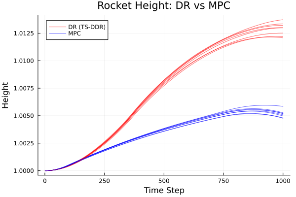

```@meta
EditURL = "rocket.jl"
```

# Rocket Control

This example trains a TS-DDR policy for a 1D rocket soft-landing problem under
wind uncertainty, then compares it against a rolling-horizon MPC baseline.

The rocket must reach height `h = 0` with velocity `v = 0` while minimizing fuel
usage, subject to random wind disturbances at each of 999 time steps.

## Problem formulation

**State**: `(v, h, m)` — velocity, height, mass.
**Action**: `u` — thrust (bounded, discretized into stages).
**Dynamics** (Euler):
```math
v_{t+1} = v_t + (u_t - g \cdot m_t + w_t) \cdot \Delta t / m_t
```
```math
h_{t+1} = h_t + v_t \cdot \Delta t
```
```math
m_{t+1} = m_t - \alpha \cdot u_t \cdot \Delta t
```

The policy outputs target states `(v̂, ĥ, m̂)` at each stage. A small optimization
subproblem projects these onto the feasible dynamics and returns the optimal thrust.

````@example rocket
using DecisionRules
using JuMP, Ipopt
using Flux
using Statistics, Random
````

## Building the problem

`build_rocket_problem` creates the deterministic-equivalent JuMP model, and
`build_rocket_subproblems` creates per-stage subproblems for stage-wise training.

````@example rocket
# ```julia
# include("build_rocket_problem.jl")
#
# det, state_in, state_out, x0, uncertainty, x_v, x_h, x_m, u_max =
#     build_rocket_problem(; penalty=1e-5)
#
# subproblems, state_in_s, state_out_s, x0_s, uncertainty_s, v, h, m, u_max_s =
#     build_rocket_subproblems(; penalty=1e-5)
# ```
````

## Policy

A small LSTM-based network maps `[wind_t; v_t; h_t; m_t]` → `[v̂, ĥ, m̂]`:

````@example rocket
# ```julia
# policy = Chain(
#     Dense(4, 32, sigmoid),
#     x -> reshape(x, :, 1),
#     Flux.LSTM(32 => 32),
#     x -> x[:, end],
#     Dense(32, 3),
# )
# ```
````

## Training

**Deterministic equivalent**: couples all stages into one NLP.

````@example rocket
# ```julia
# train_multistage(
#     policy, x0, det, state_in, state_out, uncertainty;
#     num_batches=10, optimizer=Flux.Adam(),
# )
# ```
````

**Stage-wise subproblems**: sequential per-stage solves.

````@example rocket
# ```julia
# train_multistage(
#     policy, x0_s, subproblems, state_in_s, state_out_s, uncertainty_s;
#     num_batches=10, optimizer=Flux.Adam(),
# )
# ```
````

## MPC Baseline

The rolling-horizon MPC baseline re-solves the full remaining horizon at each
stage with perfect knowledge of the current state but no future wind information.
See `run_mpc_rocket.jl`.

## Results

Height trajectories across 10 scenarios for each method:



| Method | Mean Objective | Std | Final Height (mean) |
|:---|---:|---:|---:|
| TS-DDR (DE) | — | — | — |
| TS-DDR (Subproblems) | — | — | — |
| MPC | — | — | — |

*Table values will be filled after full training runs.*

